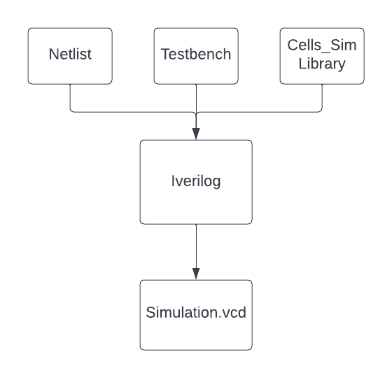

## How are the designed simulated?
The designs are simulated using the tool `Iverilog`. Once a testbench is created, Iverilog is used to take the verilog design, the testbench, and a simulation library and simulate the testbench. The simulation is stored in `.vcd` format and can be viewed to see whenever a signal's state is changed.

## How does Iverilog work?
See https://iverilog.fandom.com/wiki/Introduction for more information regarding how Iverilog works.