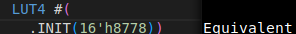
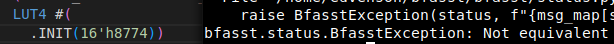
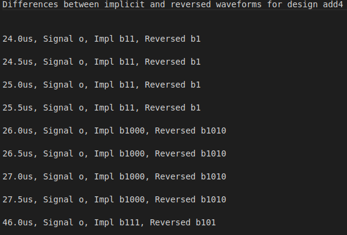

Note: These tests are based on the tests performed in "Approaches for FPGA Design Assurance" from 27 December 2021. 
To reference the article, see section 5.4 using this link: https://dl.acm.org/doi/10.1145/3491233

## LUT Corruption

By flipping a single bit in a single LUT's init string, we would expect WaFoVe to detect an error if the LUT is used in a design's path from input to Output. In other words, if an input went through a IBUF and then a LUT and then reached an OBUF and then finally an output, we would expect this IBUF to cause an error if the bits were flipped. Along this same line of logic, if an input went through an IBUF and then two LUTs but only one led to an OBUF and an output, then we would expect the other to not cause any errors with WaFoVe's detections. 

Here is an example of how this modification is performed on a given netlist:

### Netlist Structure Prior to Modification

### Netlist Structure After Modification

### Results of Modification

From the results of the modification, we can see that a single bit flip in a LUT on the path of an I/O will result in a single bit difference in the behavior of a correct netlist and a modified netlist. Thus, WaFoVe can properly catch such errors so long as they are on this given path. A percentage of similarity is provided based upon how similar the two netlists are, and from this we can determine how much of an effect a single bit flip in a LUT can have on the entire design.

To confirm whether this detection would be properly handled by WaFoVe, we flipped a single bit on 3 designs on the impl netlist and then 3 on designs on the reversed netlist. In these tests, we recorded the percentage change from a non-modified design to a modified design. Here were the results:

### Impl Single-Bit Netlist Modification

#### add4 Modification Results
| LUT Modified | Initial Bits | Modified Bits | Percent Difference |
| --- | --- | --- | --- |
| o_OBUF[0]_inst_i_1 | 4'h6 | 4'h5 | 12.13% |
| o_OBUF[1]_inst_i_1  | 16'h8778 | 16'h8768 | 1.49% | 
| o_OBUF[2]_inst_i_1 | 64'hF880077F077FF880 | 64'hF880077E077FF880 | 0.99% |
| o_OBUF[3]_inst_i_1 | 32'hE81717E8 | 32'hE41717E8 | 1.98% |
| o_OBUF[3]_inst_i_2 | 16'hE888 | 16'hF888 | 1.73% |

#### alu Modification Results
| LUT Modified | Initial Bits | Modified Bits | Average Percent Difference |
| --- | --- | --- | --- |
| result_OBUF[0]_inst_i_1   | 64'hFF00EEEEF0F0EEEE | 64'hFF00EEEEF0F1EEEE | 2.48% |
| result_OBUF[30]_inst_i_8 | 64'hC030E2F0C0FCE2F0 | 64'hC031E2F0C0FCE2F0 | 0.17% |
| result_OBUF[3]_inst_i_11 | 4'h9 | 4'h8 | 0.5% |
| result_OBUF[3]_inst_i_4 | 64'hFF6F006000000000 | 64'hFF6E006000000000 | 0.17% |
| result_OBUF[5]_inst_i_4 | 64'hFF6F006000000000 | 64'hFF6E006000000000 | 0.17% |

#### and3 Modification Results
| LUT Modified | Initial Bits | Modified Bits | Percent Difference |
| --- | --- | --- | --- |
| o_OBUF_inst_i_1 | 8'h80 | 8'h81 | 2.77% |
| o_OBUF_inst_i_1 | 8'h80 | 8'h82 | 2.97% |
| o_OBUF_inst_i_1 | 8'h80 | 8'h84 | 2.38% |
| o_OBUF_inst_i_1 | 8'h80 | 8'h88 | 2.18% |
| o_OBUF_inst_i_1 | 8'h80 | 8'h90 | 2.97% |

 
#### Average Differences Across All Designs
| Design Name | Average Percent Difference |
| --- |  --- |
| add4 | 3.66% |
| alu | 0.70% |
| and3 | 2.65% |

### Reversed Single-Bit Netlist Modification

#### add4 Modification Results
| LUT Modified | Initial Bits | Modified Bits | Percent Difference |
| --- | --- | --- | --- |
| CLBLL_L_X2Y105_SLICE_X0Y105_BLUT | 64'he817a05f17e85fa0 | 64'he817a05f07e85fa0 | 0.5% |
| CLBLL_L_X2Y105_SLICE_X0Y105_ALUT | 64'hfaa0a0a0a55a5a5a | 64'hfaa0a0a0255a5a5a | 1.73% |
| CLBLL_L_X2Y105_SLICE_X0Y105_BLUT | 64'he817a05f17e85fa0 | 64'he817a05f16e85fa0 | 0.25% |
| CLBLL_L_X2Y105_SLICE_X0Y105_ALUT | 64'hfaa0a0a0a55a5a5a | 64'hfaa0a0a0ad5a5a5a | 1.24% |
| CLBLL_L_X2Y105_SLICE_X0Y105_DLUT | 64'h5a5a5a5a5a5a5a5a | 64'h5e5a5a5a5a5a5a5a | 6.68% |

#### alu Modification Results
| LUT Modified | Initial Bits | Modified Bits | Average Percent Difference |
| --- | --- | --- | --- |
| CLBLM_R_X37Y124_SLICE_X57Y124_ALUT  | 64'hccc0888800c08888 | 64'hccd0888800c08888 | 0.17% |
| CLBLL_L_X34Y117_SLICE_X51Y117_CLUT | 64'ha8a820a8a8202020 | 64'ha8a820a8a8602020 | 0.5% |
| CLBLM_R_X35Y115_SLICE_X53Y115_CLUT | 64'hc0c044c0c0c088c0 | 64'hc0c044c1c0c088c0 | 0.33% |
| CLBLM_R_X33Y118_SLICE_X49Y118_CLUT | 64'h0c0c00008c808c80 | 64'hc1c00008c808c80 | 0.66% |
| CLBLL_L_X36Y123_SLICE_X54Y123_BLUT | 64'hffac0facf0ac00ac | 64'hefac0facf0ac00ac | 0.17% |

#### and3 Modification Results
| LUT Modified | Initial Bits | Modified Bits | Percent Difference |
| --- | --- | --- | --- |
| CLBLL_L_X2Y102_SLICE_X1Y102_BLUT | 64'h0000000000000000 | 64'h20 | 2.57% |
| CLBLL_L_X2Y102_SLICE_X0Y102_BLUT | 64'h0000000000000000 | 64'h4 | 2.57% |
| CLBLL_L_X2Y102_SLICE_X0Y102_DLUT | 64'h0000000000000000 | 64'h20 | 2.57% |
| CLBLL_L_X2Y102_SLICE_X0Y102_ALUT | 64'hf0000000f0000000 | 64'hf0000000f0080000 | 2.57% |
| CLBLL_L_X2Y102_SLICE_X1Y102_BLUT | 64'h0000000000000000 | 64'h40 | 2.57% |
 
#### Average Differences Across All Designs
| Design Name | Average Percent Difference |
| --- |  --- |
| add4 | 2.08% |
| alu | 0.70% |
| and3 | 2.57% |

### Impl Five-Bit Netlist Modification

#### add4 Modification Results
| LUT Modified | Initial Bits | Modified Bits | Percent Difference |
| --- | --- | --- | --- |
| o_OBUF[1]_inst_i_1  | 16'h8778 | 16'h8FFF | 7.67% | 
| o_OBUF[2]_inst_i_1 | 64'hF880077F077FF880 | 64'hF880077FF77FF980 | 1.98% |
| o_OBUF[3]_inst_i_1 | 32'hE81717E8 | 32'hE88787F8 | 3.22% |
| o_OBUF[3]_inst_i_2 | 16'hE888 | 16'hE292 | 1.98% |
| o_OBUF[1]_inst_i_1  | 16'h8778 | 16'h1671 | 9.9% | 

#### alu Modification Results
| LUT Modified | Initial Bits | Modified Bits | Average Percent Difference |
| --- | --- | --- | --- |
| result_OBUF[0]_inst_i_1   | 64'hFF00EEEEF0F0EEEE | 64'hFF00EEEEF0FFEEEF | 4.29% |
| result_OBUF[30]_inst_i_8 | 64'hC030E2F0C0FCE2F0 | 64'hC03FE2F0C0FCE2F1 | 0.83% |
| result_OBUF[3]_inst_i_4 | 64'hFF6F006000000000 | 64'hFF6F00F000000700 | 0.66% |
| result_OBUF[5]_inst_i_4 | 64'hFF6F006000000000 | 64'hF06F006000000001 | 1.32% |
| result_OBUF[3]_inst_i_4 | 64'hFF6F006000000000 | 64'hFE6F00F100000010 | 1.49% |

#### and3 Modification Results
| LUT Modified | Initial Bits | Modified Bits | Percent Difference |
| --- | --- | --- | --- |
| o_OBUF_inst_i_1 | 8'h80 | 8'h9F | 13.27% |
| o_OBUF_inst_i_1 | 8'h80 | 8'h0F | 12.87% |
| o_OBUF_inst_i_1 | 8'h80 | 8'hAF | 12.38% |
| o_OBUF_inst_i_1 | 8'h80 | 8'hF3 | 12.87% |
| o_OBUF_inst_i_1 | 8'h80 | 8'hF9 | 12.08% |

#### Average Differences Across All Designs
| Design Name | Average Percent Difference |
| --- | --- |
| add4 | 4.95% |
| alu | 1.72% |
| and3 | 12.69% |

### Reversed Five-Bit Netlist Modification

#### add4 Modification Results
| LUT Modified | Initial Bits | Modified Bits | Percent Difference |
| --- | --- | --- | --- |
| CLBLL_L_X2Y105_SLICE_X0Y105_DLUT | 64'h5a5a5a5a5a5a5a5a | 64'h5e525c5a5a1a5a5a | 6.68% |
| CLBLL_L_X2Y105_SLICE_X0Y105_BLUT | 64'he817a05f17e85fa0 | 64'hc85fa05f17e8df80 | 0.99% |
| CLBLL_L_X2Y105_SLICE_X0Y105_DLUT | 64'h5a5a5a5a5a5a5a5a | 64'h5e5a5a5ada5a1a59 | 6.68% |
| CLBLL_L_X2Y105_SLICE_X0Y105_CLUT | 64'hc993366cc993366c | 64'hc99b366cc1c3366e | 0.5% |
| CLBLL_L_X2Y105_SLICE_X0Y105_ALUT | 64'hfaa0a0a0a55a5a5a | 64'hfea0a6a2a5da5a5a | 3.71% |

#### alu Modification Results
| LUT Modified | Initial Bits | Modified Bits | Percent Difference |
| --- | --- | --- | --- |
| CLBLL_L_X34Y117_SLICE_X51Y117_ALUT | 64'hfffcfff8fff8fff0 | 64'hbffc3ff8eef8fff0 | 0.66% |
| CLBLL_L_X34Y121_SLICE_X51Y121_BLUT | 64'hf0f0f0f0d050c000 | 64'hf0f0b0f0d050cc42 | 1.49% |
| CLBLL_L_X34Y115_SLICE_X51Y115_DLUT | 64'hff5f000a44ff4400 | 64'hf75f000a85ff4440 | 0.17% |
| CLBLL_L_X38Y125_SLICE_X58Y125_DLUT | 64'h0000000000100000 | 64'h40029 | 0.99% |
| CLBLM_R_X37Y124_SLICE_X56Y124_DLUT | 64'hf070d050a0208000 | 64'hb070c0d0b0308000 | 0.5% |

#### and3 Modification Results
| LUT Modified | Initial Bits | Modified Bits | Percent Difference |
| --- | --- | --- | --- |
| CLBLL_L_X2Y102_SLICE_X0Y102_ALUT | 64'hf0000000f0000000 | 64'hb8c00000f0000400 | 4.16% |
| CLBLL_L_X2Y102_SLICE_X0Y102_ALUT | 64'hf0000000f0000000 | 64'hf0004084f0000820 | 2.97% |
| CLBLL_L_X2Y102_SLICE_X0Y102_ALUT | 64'hf0000000f0000000 | 64'hf0000180f00a0080 | 2.97% |
| CLBLL_L_X2Y102_SLICE_X0Y102_ALUT | 64'hf0000000f0000000 | 64'hf0009004f0400080 | 2.18% |
| CLBLL_L_X2Y102_SLICE_X0Y102_ALUT | 64'hf0000000f0000000 | 64'hf0908000f0000030 | 4.36% |

#### Average Differences Across All Designs
| Design Name | Average Percent Difference |
| --- | --- |
| add4 | 3.71% |
| alu | 0.76% |
| and3 | 3.32% |

## Crossed Wires

### Impl Single-Switch Netlist Modification

#### alu Modification Results
| Wire1 | Wire2 | Percent Difference |
| --- | --- | --- |
| result_OBUF[0]_inst_i_2_n_0  | result_OBUF[14]_inst_i_7_n_0 | 1.82% |
| result_OBUF[0]_inst_i_13_n_0 | result_OBUF[10]_inst_i_7_n_0 | 0.33% | 

