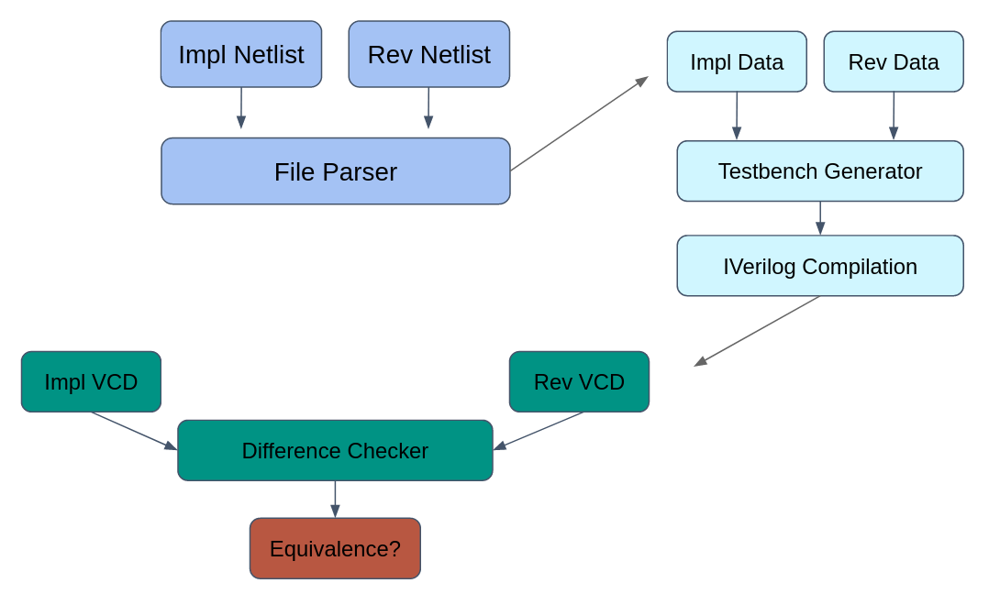

## What is WaFoVe?
WaFoVe: A Waveform Verification tool. In other words, a tool used to confirm that two Verilog designs are equivalent through analyzing their waveforms.

## How does WaFoVe work?
WaFoVe follows a simple process:
1. WaFoVe begins with 2 netlists of the same design and, using Spydrnet, parses them for all of their IOs (See `File Parsing.md` for more info).
2. WaFoVE then takes this data and creates a randomized testbench for the two designs (See `Testbench Generation.md` for more info).
3. Once this testbench has been created, a simulation of the testbench is dumped using Iverilog into a VCD file (See `Design Simulation.md` for more info).
4. The VCD files of the two designs are then logically compared to confirm that all IOs respond the same way (See `Difference Checking.md` for more info).
Equivalence is then determined based upon whether or not the IOs respond exactly the same way. If they respond differently at any point, the designs are not considered to be equivalent.

## What tools does WaFoVe rely on?
Currently WaFoVe uses these tools in it's processes:
* Spydrnet: Spydrnet is used to analyze the IO's in a design and compile all of them into one array.
* IVerilog: Icarus Verilog is used in the compilation of a design's testbench and netlist into a VCD file.
* Yosys: A technology library file from Yosys is used by IVerilog in it's compilation process (_cells_sim.v_).
See `File Parsing.md` for an in-depth explanation into how all three of these tools are used.

Other optional tools that WaFoVe supports are:
* Gtkwave: Gtkwave can be used to view the waveforms created by Iverilog to visualize how well the process worked
* Vivado: Vivado can also be used to compare a design with gtkwave's visualization. Since Vivado only shows the testbench and doesn't analyze the VCD file, it can be used as a point of verification that the VCD file simulates the testbench perfectly.

## How accurate are WaFoVe's test benches?
Currently, WaFoVe's test benches are completely random and run a default of 100 tests on a design. As such, they may not raise all IO's in a design. To accommodate this issue, WaFoVe reports on if any of the IOs were not raised in the output folder with two text file. These text files can be expanded upon using `-a` or `--allSignals`, which will allow all signals of the design checked for whether they are raised rather than only checking the IOs. WaFoVe also has a flag `-s` or `--seed` that can be used to signify a seed that the test bench's random function should base itself off of. Finally, WaFoVe has an option `-t` or `--tests` to select how many tests are run on a design. This number can be increased from 100 to increase the likelihood of all signals being raised properly. See `Testbench Generation.md` for more information regarding how the testbenches are generated.

## Will WaFoVe delete test results after usage?
To prevent users from accidentally deleting the results of an experiment, WaFoVe expects a `--newTests` flag before it will delete the old files in an output folder. The user can specify a different output folder as well by using the `--base` flag. 

## Does WaFoVe support other tech libraries aside from Yosys' Xilinx library?
Yes, and any other tech libraries can be specified using the command `--tech` 

## How do I use gtkwave with WaFoVe?
To use gtkwave with WaFoVe, you must:
* Ensure gtkwave is installed
* Use the `--waveform` flag when running WaFoVe
* (optional) use the `-f` or `--fullScreen` flag to launch gtkwave in fullscreen mode

Once these steps are done, gtkwave will launch showing the generated waveforms for both files.

## How do I use Vivado with WaFoVe?
To use Vivado with WaFoVe, you must:
* Ensure Vivado is installed
* Set `VIVADO_PATH` environmental variable to your local path to your vivado launcher (ex: `/tools/Xilinx/Vivado/2022.2/bin/vivado`)
* Use the `--waveform` flag
* Use the `--vivado` flag