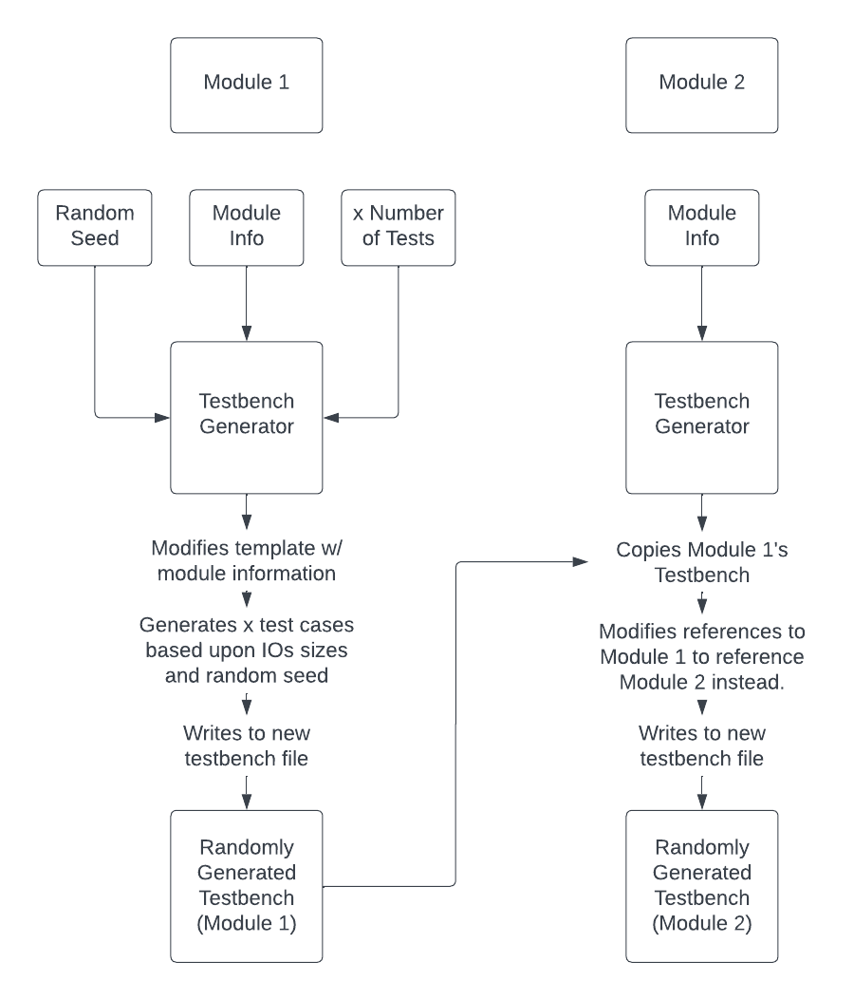

## How are Testbenches Generated?
In `file_generation/testbench_generator.py`, an algorithm is used to create randomized testbenches for the design being input into WaFoVe. First, a compiled list of signals is provided in the variable data alongside all of the relevant paths for the output testbenches in `generate_testbench()`. Then, a sample testbench is opened and modified to include the name of the module, the I/Os, and the actual signal states. For the signal states, these are generated randomly based upon the bitsize of each input, the given seed for the random function, and the number of tests that the user expects. So, if the user sets a random seed to 100 and the number of tests to 1000 and an input is test[0:5], the random() function is used 1000 times based upon seed 100 to select a number between 0 and (2^5)-1 for the variable test. This generated testbench is then copied for the second file input into WaFoVe since it is assumed that all IOs are the same between the two (otherwise the two designs are obviously non-equivalent.)

## How effective are the Testbenches?
As a part of the equivalence checking process, the generated testbenches will be analyzed for how many outputs are properly raised after simulation. This process is done in `file_parsing/parse_diff.py` in the `check_signals()` function. If a signal is only called once (or in other words, is only initialized), then it is considered to not be effectively tested. A percentage is provided in the terminal on how many of the signals were raised properly and a full list is provided in the output folder. This list can be an effective tool for tracking down unconnected components and wires inside of a design. If a user wishes to see how many of the wires are raised in a design rather than just the IO's, the `-a` or `--allSignals` flag can be used to do so.

## Can WaFoVe's Testbenches be used on Regular Designs?
Unfortunately, the method of testbench generation used by WaFoVe is specifically for netlists. A simple verilog design would need to have a netlist generated for it before it would be able to be ran through the testbench generator. This is because SpyDrNet is used for parsing all of the components of the netlist and it is currently not compatible with regular verilog designs.

## Are There Any Limitations to WaFoVe's Testbench Generator?
Yes. At this time, any clock signals that are not named `clk` will not be parsed properly. This means multi-clock designs will need to have the code be modified. In `testbench_generator`, any references to `clk` can be modified to include whichever names of clocks exist in the design being tested. For instance,a line saying `if input_signals != "clk"` can be modified to `if input_signals != "clk" || input_signals != "clk_2"`. While far from ideal, due to time constraints, I did not have time to implement a clock parsing feature properly.

## How Many Tests can a Testbench Run?
Theoretically, an unlimited amount. Realistically, I wouldn't recommend more than 10,000. This is because a testbench generated by WaFoVe will be run and parsed and the process can take a long time with large amounts of test cases. So, when using the `-t` or `--tests` flag, keeping the maximum amount of tests limited will maximize performance.